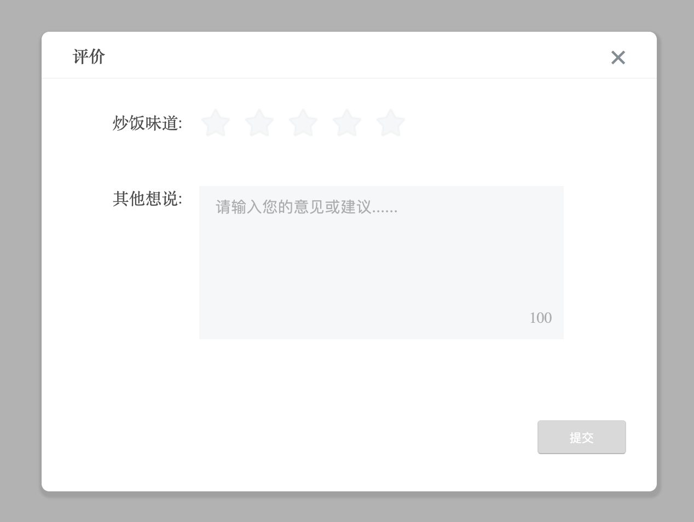
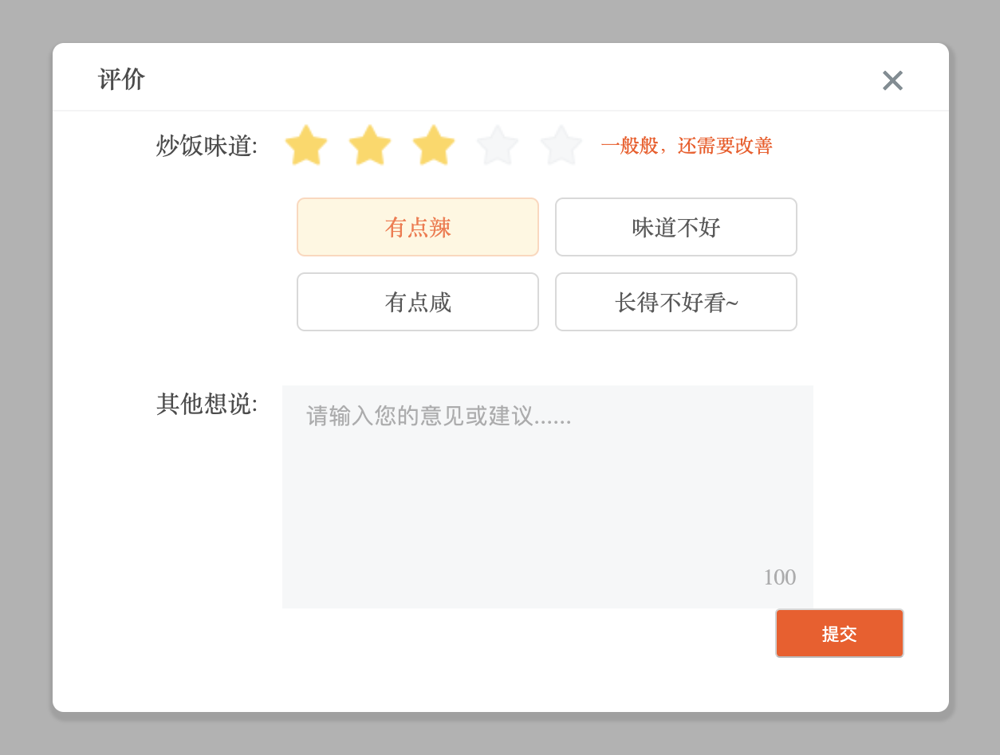
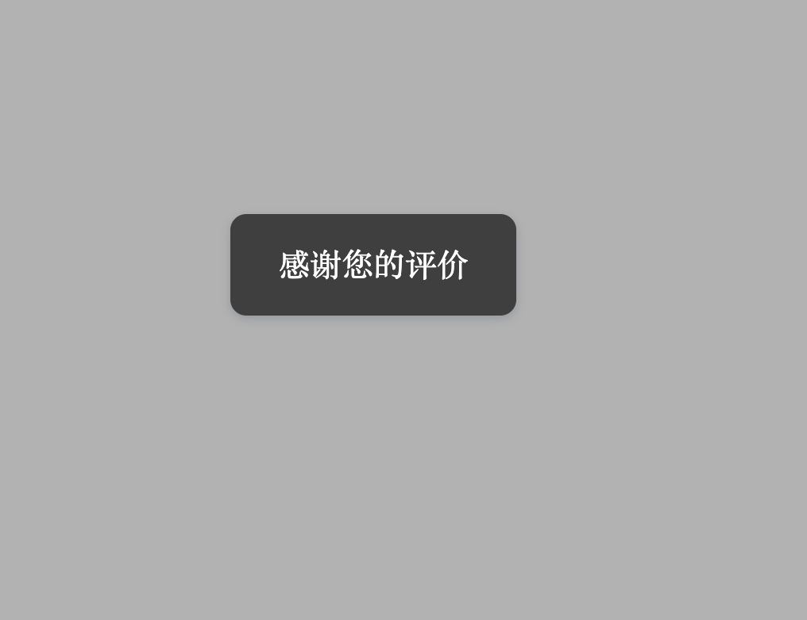

> components 
#####  Property 'stars' has no initializer and is not definitely assigned in the constructor
###### 如果出现上述问题,原因是:
###### 新版本中,当tsconfig.json中,选项 strictPropertyInitialization:true 的时候，编译器会确保类中所有的属性都已经初始化，否则报错
###### 解决办法: 将文件中该设置改为falsestrictPropertyInitialization:false

#### 美食评价的插件
#### index.js的代码
> ##### 第一步: install(Vue){}接收Vue参数

> ##### 第二步: 创建Comment的Vue构造器
`const Toast = Vue.extend(Comment)`

> ##### 第三步:将Comment组件实例挂载到指定的元素(div),并手动渲染
`const instance=new Toast().$mount(document.createElement("div")) ||  new Toast().$mount()`

> ##### 第四步:将渲染好的组件实例挂载到body的节点中,可以通过$el属性来访问组件实例
`Vue.prototype.$comment=document.body.appendChild(instance.$el)`
###### 可以通过将一些属性暴露出来,组件可接收用户对属性的修改.也可以写show或者hide等方法控制组件的显示和隐藏或进行其他操作,本组件中增加了show和hide方法可处理组件的显示和隐藏,暴露commentBoxStatus和stars属性,用户可执行修改,满足评价组件的基本要求 

----

#### 遇到的一些问题:
> ##### 1.在利用TypeScrip进行Vue项目开发时,最好创建vue-shim.d.ts文件,主要是告诉TypeScript遇到*.vue文件时,交给vue模块进行处理,且在后续的开发中,需要引入vue文件时,最好引入为*.vue文件,也是便于typescript识别vue文件
> ##### 2.遇到报错如下:
```
TS2339: Property 'flag' does not exist on type '{ _close(): void; mouseEnter(idx: any): void; changeStarLabel(num: any): void; mouseLeave(): void; handleSelected(n: any): void; handleEvent(e: any): void; handleSelectedMarks(param: any): void; changeSubmitStatus(e: any): boolean; setWordLimit(): void; handleSubmit(): Promise<...>; handleEndClass(): void; }'.
TS2339: Property 'commentBoxStatus' does not exist on type '{ _close(): void; mouseEnter(idx: any): void; changeStarLabel(num: any): void; mouseLeave(): void; handleSelected(n: any): void; handleEvent(e: any): void; handleSelectedMarks(param: any): void; changeSubmitStatus(e: any): boolean; setWordLimit(): void; handleSubmit(): Promise<...>; handleEndClass(): void; }'.
......
```
###### 以上一系列类似的错误,其中flag和commentBoxStatus均为vue组件中data里的变量,在methods中使用data中变量时(`eg:this.commentBoxStatus=true`),就会报错(认为该变量不存在),查询很久方法后,终于找到了一个方法:将`this.commentBoxStatus=true`改为`this[“commentBoxStatus”]=true`就不会出现该问题,同时,在ts中使用该组件时,也使用该引用方法

#### 评价组件如下样式:





